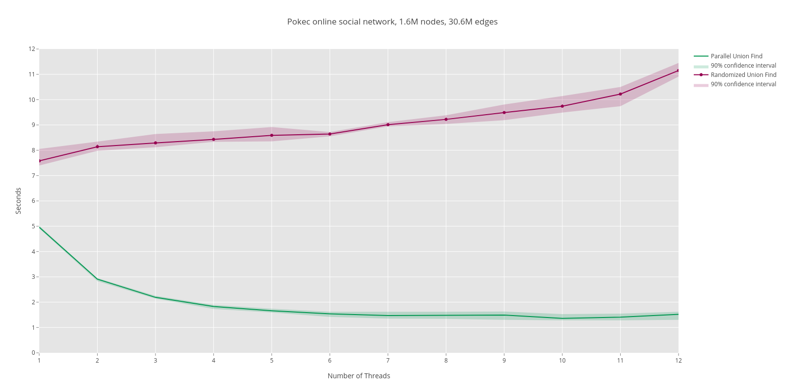
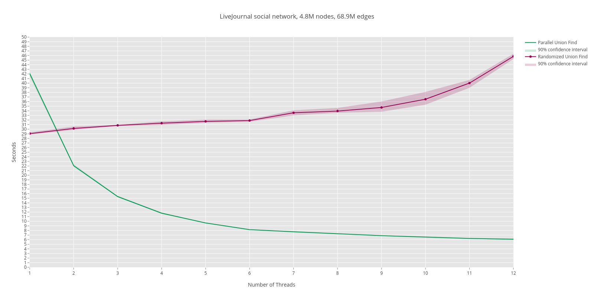

## Header-only library for finding strongly connected components
Usage example:
```C++
#include <vector>
#include <thread>
#include <cassert>

#include "algorithm/concurrent_algorithm.hpp"
#include "graph_node/concurrent_graph_node.hpp"
#include "union_node/lockfree/on_the_fly_scc_union_node.hpp"

using namespace parallel_union_find::algorithm;
using namespace parallel_union_find::graph_node;
using namespace parallel_union_find::union_node::lockfree;

using node = concurrent_graph_node<on_the_fly_scc_union_node>;

node n1;
node n2;

int main()
{
    // create graph
    n1.add_son(&n2);
    n2.add_son(&n1);

    // run on as many threads as you wish
    std::vector<std::thread> threads;

    for (unsigned int i = 0; i < std::thread::hardware_concurrency(); ++i)
        threads.emplace_back(concurrent_algorithm<node>, &n1, (1 << i));

    for (std::thread& t : threads)
        t.join();

    // reconstruct strongly connected components
    assert(n1.find_set() == n2.find_set());
}
```

Customized graph:
TODO

## APIs
TODO

## Performance Comparison
Comparing performance on real-world data from Slovak social network Pokec: https://snap.stanford.edu/data/soc-pokec.html.
Algorithms are finding SCCs(Strongly Connected Components) in oriented graph which represents friendships.
It looks for SCCs which are reachable from node with 'ID = 1'.

Algorithm based on paper in green, randomized algorithm in red.


Looking for SCCs in friendships from LiveJournal SocialNetwork: https://snap.stanford.edu/data/soc-LiveJournal1.html.

